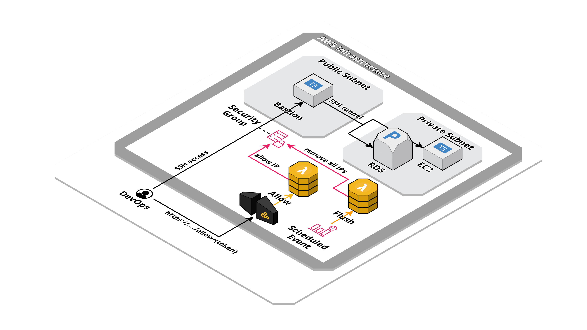

# AWS Security Group dynamic IP whitelist


This application will deploy a Lambda function connected to an HTTP API. When a request is made to the exported endpoint the source IP will allowed on Security Group with specified port and protocol.

## Created resources

This application will create two Lambda function for manage allow IP and flush rules process. Allow IP Lambda function has permissions to call AuthorizeSecurityGroupIngress EC2 API. Flush rules Lambda function has permissions to describe security group and call RevokeSecurityGroupIngress EC2 API. An API Gateway endpoint is created and connected to the allow IP Lambda function. A scheduled CloudWatch Event is created to trigger flush rules Lambda function at regular intervals.



## Installation

| Region       | Deploy Link |
| ------------ | ----------- |
| eu-west-1    | [](https://eu-west-1.console.aws.amazon.com/cloudformation/home#/stacks/create/review?templateURL=https://bitbull-serverless-templates-butoamoogh8eigo.s3.eu-west-1.amazonaws.com/dynamic-ip-whitelist/template.yml&stackName=dynamic-ip-whitelist) |
| eu-central-1 | [](https://eu-central-1.console.aws.amazon.com/cloudformation/home#/stacks/create/review?templateURL=https://bitbull-serverless-templates-saijuozaeshae6e.s3.eu-central-1.amazonaws.com/dynamic-ip-whitelist/template.yml&stackName=dynamic-ip-whitelist) |
| us-east-1    | [](https://us-east-1.console.aws.amazon.com/cloudformation/home#/stacks/create/review?templateURL=https://bitbull-serverless-templates-chai7ephae5eet2.s3.us-east-1.amazonaws.com/dynamic-ip-whitelist/template.yml&stackName=dynamic-ip-whitelist) |
| us-east-2    | [](https://us-east-2.console.aws.amazon.com/cloudformation/home#/stacks/create/review?templateURL=https://bitbull-serverless-templates-xae9och1eipiem8.s3.us-east-2.amazonaws.com/dynamic-ip-whitelist/template.yml&stackName=dynamic-ip-whitelist) |

Using the [SAM CLI](https://docs.aws.amazon.com/serverless-application-model/latest/developerguide/what-is-sam.html):
```bash
sam build
sam deploy --guided
```

Including in an other SAM template:
```yaml
AWSTemplateFormatVersion: '2010-09-09'
Transform: AWS::Serverless-2016-10-31

Resources:
  DynamicIpWhitelist:
    Type: AWS::CloudFormation::Stack
    Properties:
      TemplateURL: # pick a templates links from section below, based on your region
      Parameters:
        Token: xxxxxxxxxxxxxxxxxxxxxxxxx
        SecurityGroupId: sg-xxxxxxxxxxxx
```

## Public templates

| Region       | Template URLs                                                                                                  |
| ------------ | -------------------------------------------------------------------------------------------------------------- |
| eu-west-1    | https://bitbull-serverless-templates-butoamoogh8eigo.s3.eu-west-1.amazonaws.com/dynamic-ip-whitelist/template.yml    |
| eu-central-1 | https://bitbull-serverless-templates-saijuozaeshae6e.s3.eu-central-1.amazonaws.com/dynamic-ip-whitelist/template.yml |
| us-east-1    | https://bitbull-serverless-templates-chai7ephae5eet2.s3.us-east-1.amazonaws.com/dynamic-ip-whitelist/template.yml    |
| us-east-2    | https://bitbull-serverless-templates-xae9och1eipiem8.s3.us-east-2.amazonaws.com/dynamic-ip-whitelist/template.yml    |

## Parameters

This application need some required parameters when you deploy it:

- **Token**: The token used to validate the request, requires at least 20 characters in length.

- **SecurityGroupId**: The Security Group where add rules to.

- **DomainName**: The domain name of website.

- **AcmCertificateArn**: The certificate arn for the domain name provided.

- **HostedZoneId**: The Route53 hosted zone ID used for the domain.

Optional parameters:

- **IngressPort**: Ingress port to allow. Can be also a range, for example "7000-8000".

- **IngressProtocol**: Ingress protocol to allow. Can be TCP, UDP or ICMP.

- **RuleDescription**: The rules descriptions used to identify rules.

- **FlushScheduleExpression**: The CloudWatch Event scheduled expression to trigger flush rules process.

## Outputs

- **TokenParameterId**: The SSM Parameter where Token value is stored.

- **Endpoint**: The endpoint to send request to whitelist IP, for example `https://xxxxxx.execute-api.eu-west-1.amazonaws.com/test/<place here the provided token>/`.

## Credits

- Repository badges by [Shields.io](https://shields.io/)
- Infrastructure schema by [Cloudcraft](https://www.cloudcraft.co/)
